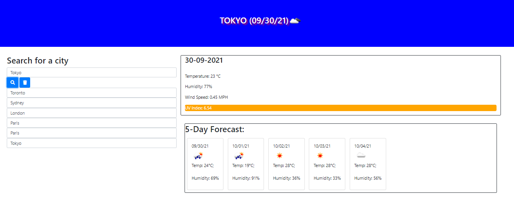

Name: Nikhil Kharbanda  
Project: Weather-Dashboard  
URL to project: https://nikhil-kharbanda.github.io/UofT-WeatherDashboard/  
Due: September 28th, 2021  

In this assignment, we were tasked to make a simple weather dashboard using the openweather api.  

Checklist:  
[X] Can search for a city and see that cities date, an icon with their current weather, and the 5 day forecast . It also shows the humidity, UV-Index and windspeeds.  
[X] The UVIndex has a certin threshold value indicating if sunscreen is required or not.  
[X] The city that is searched is then saved in a list like format under the textbox bar. This is to allow the user to switch back and forth cities to see the weather.  
[X] The search results are also saved to local storage.  

Sample weather output  

NOTE:  
I know the assignment said to convert to imperial, but i set it to Celcius. I did create a function to easily switch between the 2, just need to replace k2c to k2f  
  
To run the program, clone this repo and open the index.html file in your browser.  
